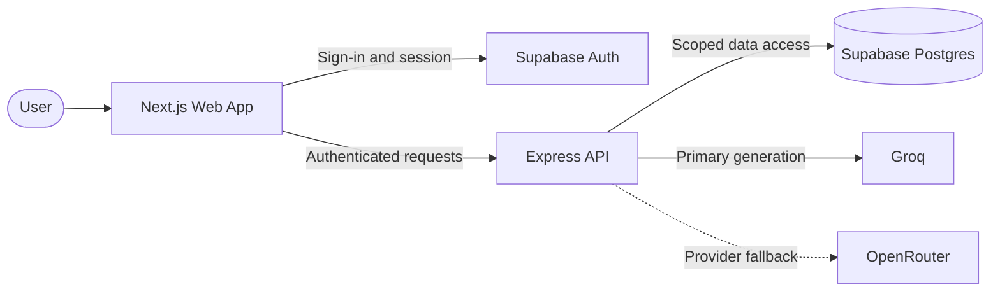

# Sthira

### A quieter place to notice, reflect, and respond with intention.

Sthira is a private reflection experience built around mood check-ins, enduring perspectives, thoughtful conversation, journaling, and personal insights.

[Why Sthira](#why-i-built-this) · [Experience](#product-experience) · [Architecture](#system-architecture) · [Technology](#technology-and-purpose) · [Privacy](#security-and-privacy)

---

> **Pause. Notice. Choose a steadier response.**  
> Sthira creates room between a feeling and the action that follows it.

## Why I built this

Many reflection products turn deeply personal moments into scores, streaks, or generic advice. I wanted to build something calmer: an experience that respects uncertainty, preserves personal judgment, and makes enduring ideas useful without separating them from their source.

Sthira began with one question:

> What if technology could help someone pause before reacting, find words for what they feel, and keep the thoughts worth returning to?

The result is a space for reflection—not a system that tries to diagnose, prescribe, or make decisions for the person using it.

## Product experience

Every reflection follows a deliberate five-part flow:

| 01 — Notice | 02 — Express | 03 — Explore | 04 — Continue | 05 — Keep |
|---|---|---|---|---|
| Choose the feeling that best fits the moment. | Add context in your own words. | Receive a relevant, source-aware passage. | Reflect with a Perspective or the Companion. | Save the passage and your thoughts privately. |

### One connected space

| Experience | What it provides |
|---|---|
| **Home** | Mood check-ins, daily wisdom, recent activity, and continuity |
| **Perspectives** | Distinct spaces for the Bhagavad Gita, Buddha, Marcus Aurelius, Rumi, and Albert Camus |
| **Companion** | Encouraging conversation across the complete passage collection, with every tradition clearly identified |
| **Library** | Searchable and theme-based access to curated passages |
| **Journal** | Saved passages and personal reflections in one private space |
| **Insights** | Streaks, mood patterns, and reflection summaries presented without judgment |

## System architecture

The frontend owns the interactive experience and authenticated session. The API verifies every protected request, retrieves relevant passages, performs private application operations, and coordinates generated responses. Supabase stores persistent data; language providers are contacted only when a generated reflection or conversation response is requested.

## Technology and purpose

| Layer | Technology | Purpose |
|---|---|---|
| **Interface** | Next.js, React, TypeScript | Responsive application experience with type-safe UI contracts |
| **API** | Express, TypeScript | Stateless request handling, validation, authentication, and orchestration |
| **Identity** | Supabase Auth | Account authentication and session management |
| **Data** | Supabase Postgres | Passages, check-ins, conversations, journal entries, streaks, and insights |
| **Authorization** | PostgreSQL Row Level Security | Ownership enforcement at the database boundary |
| **Generation** | Groq, OpenRouter | Primary generated responses with one bounded fallback |
| **Hosting** | Vercel, Render | Separate frontend and API deployments |

The system remains intentionally lightweight: persistent state stays in Postgres, passage searches are indexed and bounded, and the API runs as a single stateless service.

## Security and privacy

Reflection is personal. Sthira treats privacy as an architectural boundary, not only an interface promise.

| Boundary | Protection |
|---|---|
| **Identity** | Protected requests require a verified authenticated user |
| **Ownership** | Row Level Security isolates profiles, check-ins, journals, conversations, and insights |
| **Credentials** | Database and language-provider secrets remain on the server |
| **Browser** | Client code receives only public Supabase configuration |
| **Responses** | Authenticated data is private and non-cacheable |
| **Logging** | Credentials, request bodies, prompts, and reflection text are excluded |
| **Content** | Public passage access excludes internal prompts and retired records |
| **Generation** | History, input, output, timeout, and provider fallback are explicitly bounded |

Sthira is a reflective companion, not a medical service, diagnostic tool, or substitute for professional support.

## Structure

| Notice | Explore | Keep | Understand |
|---|---|---|---|
| Mood check-in | Perspectives | Journal | Streaks |
| Personal context | Companion | Saved passages | Mood patterns |
| Daily wisdom | Library | Private notes | Reflection insights |

These four areas support one purpose: helping someone move from an immediate feeling toward a steadier, more considered response.

---

Built with love ❤️ by **Ekagra Gupta**

[Website](https://ekagrazi.com/) · [LinkedIn](https://www.linkedin.com/in/ekagrazi) · [GitHub](https://github.com/ekagrazi)

